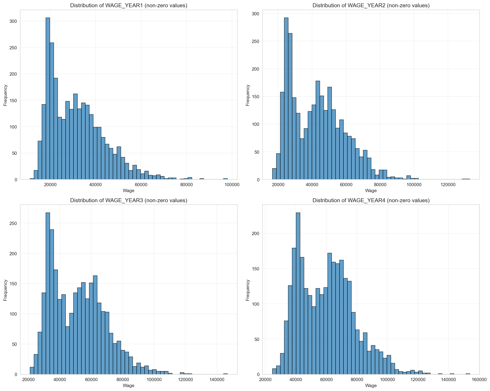
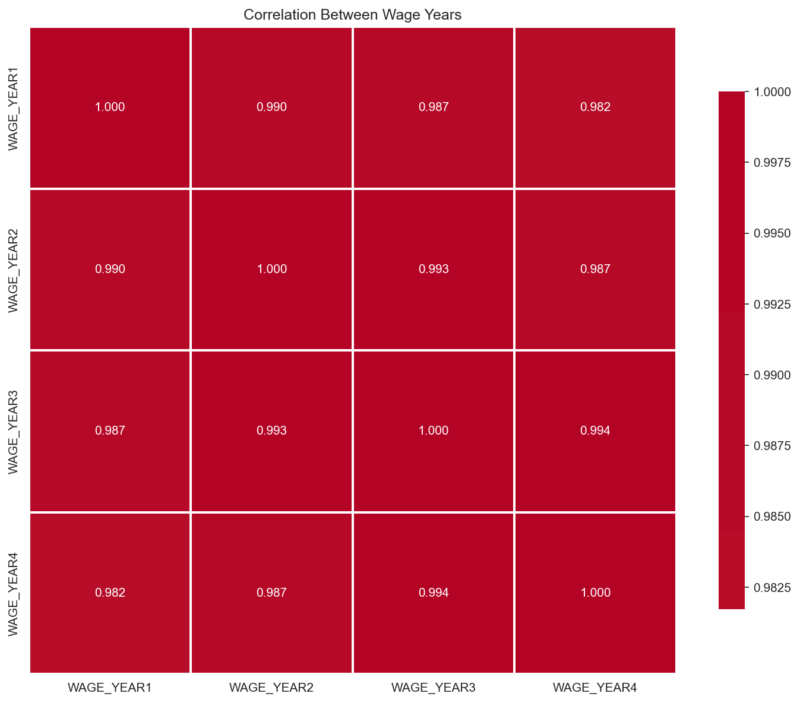
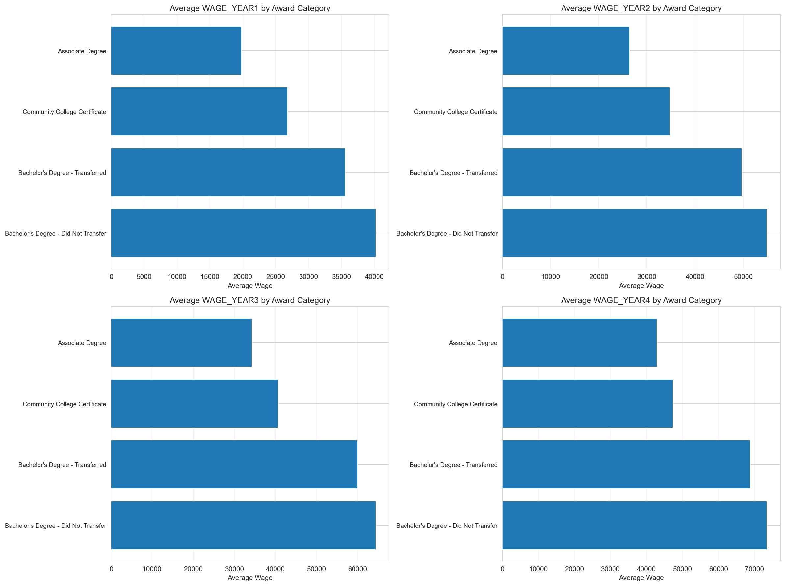

# x62-data-challenge-student-pathways

## Part 1. Data Exploration

Data quality: For each feature (column), what is the data type? Is there any missing data?

The dataset has 20,705 rows and 11 columns. Here's what I found about data types and missing values.

Data types:
DISTRICT_TYPE is a string (object type)
DISTRICT_NAME is a string (object type)
DISTRICT_CODE is a number (float64)
ACADEMIC_YEAR is a string (object type)
DEMO_CATEGORY is a string (object type)
STUDENT_POPULATION is a string (object type)
AWARD_CATEGORY is a string (object type)
WAGE_YEAR1 is a number (float64)
WAGE_YEAR2 is a number (float64)
WAGE_YEAR3 is a number (float64)
WAGE_YEAR4 is a number (float64)

Missing data:
There is one column with missing values. DISTRICT_CODE has 2,745 missing values, which is about 13.26% of the data. Looking at the data, these missing values appear when DISTRICT_TYPE is "Legislative District" since legislative districts don't have numeric codes like school districts do. All other columns have no missing data.

Range: What are the unique values for each categorical column? What is the range of values of the numeric columns? Are the numeric column values normally distributed?

Categorical columns and their unique values:

DISTRICT_TYPE has 3 unique values: School District, Legislative District, All

DISTRICT_NAME has 692 unique values. Too many to list, but includes names like "Duarte Unified", "Coronado Unified", etc.

ACADEMIC_YEAR has only 1 unique value: 2018-2019. All data is from the same academic year.

DEMO_CATEGORY has 5 unique values: Race, Homeless Status, All, Foster Status, Gender

STUDENT_POPULATION has 15 unique values: None Reported, Black or African American, Did Not Experience Homelessness in K-12, American Indian or Alaska Native, Native Hawaiian or Other Pacific Islander, All, Two or More Races, Foster Youth, Female, White, Experienced Homelessness in K-12, Not Foster Youth, Male, Asian, Hispanic or Latino

AWARD_CATEGORY has 4 unique values: Bachelor's Degree - Did Not Transfer, Associate Degree, Community College Certificate, Bachelor's Degree - Transferred

Numeric columns and their ranges:

DISTRICT_CODE ranges from 110,017 to 5,872,769, with a mean of about 3,041,331. All values are non-zero, though 13.26% are missing.

WAGE_YEAR1 ranges from 0 to 97,993. Mean is 4,476.11, but median is 0. Only 14.2% of values are non-zero (2,935 out of 20,705 rows). For non-zero values, the mean is 31,576.76 with standard deviation of 12,277.11.

WAGE_YEAR2 ranges from 0 to 132,847. Mean is 6,075.53, median is 0. Only 14.2% are non-zero. For non-zero values, mean is 42,859.94 with standard deviation of 16,165.71.

WAGE_YEAR3 ranges from 0 to 146,728. Mean is 7,310.83, median is 0. Only 14.2% are non-zero. For non-zero values, mean is 51,574.37 with standard deviation of 17,503.76.

WAGE_YEAR4 ranges from 0 to 153,910. Mean is 8,530.89, median is 0. Only 14.2% are non-zero. For non-zero values, mean is 60,181.29 with standard deviation of 18,415.61.

Are the numeric column values normally distributed?

Looking at the wage columns (the main numeric features we care about), they are not normally distributed. The distributions are right-skewed, meaning most values are on the lower end with a long tail of higher values. This makes sense for salary data. I tested this using Shapiro-Wilk tests on samples of the non-zero wage values, and all four wage years show W statistics around 0.92-0.97, which indicates deviation from normality. A perfect normal distribution would have W = 1.0.

The histogram below shows the distributions of the wage columns for non-zero values:

Semantics: What is the meaning of the columns? Are any columns related to other columns? (If so, how?)

What the columns mean:

DISTRICT_TYPE indicates whether the row represents data for a School District, Legislative District, or All districts combined.

DISTRICT_NAME is the name of the specific district, like "Duarte Unified" or "Senate District 15".

DISTRICT_CODE is a numeric identifier for school districts. Legislative districts don't have codes, which is why this field is missing for those rows.

ACADEMIC_YEAR is the school year the data comes from. All data in this dataset is from 2018-2019.

DEMO_CATEGORY tells you what type of demographic grouping is being used: Race, Homeless Status, Foster Status, Gender, or All.

STUDENT_POPULATION is the specific demographic group within the category. For example, if DEMO_CATEGORY is "Race", then STUDENT_POPULATION might be "White", "Black or African American", "Asian", etc.

AWARD_CATEGORY is the type of degree or certificate the students earned: Bachelor's Degree (either transferred or did not transfer), Associate Degree, or Community College Certificate.

WAGE_YEAR1 through WAGE_YEAR4 are the average earnings for students in that group in their 1st, 2nd, 3rd, and 4th year after graduation.

Relationships between columns:

The wage columns are highly correlated with each other. WAGE_YEAR1, WAGE_YEAR2, WAGE_YEAR3, and WAGE_YEAR4 all correlate strongly (correlation coefficients around 0.98 to nearly 1.0), which makes sense since students who earn more in year 1 tend to earn more in later years too. The correlation heatmap below shows this:

There's a clear relationship between AWARD_CATEGORY and wages. Students with Bachelor's degrees tend to earn more than those with Associate degrees, who earn more than those with Community College Certificates. The chart below shows average wages by award category:

DEMO_CATEGORY and STUDENT_POPULATION work together to describe the demographic group. For example, when DEMO_CATEGORY is "Race", STUDENT_POPULATION contains specific race categories. When DEMO_CATEGORY is "Homeless Status", STUDENT_POPULATION is either "Experienced Homelessness in K-12" or "Did Not Experience Homelessness in K-12".

DISTRICT_CODE and DISTRICT_NAME are related, but not perfectly one-to-one. Some district names might appear with different codes in different contexts, though most have a single code. Legislative districts don't have codes at all.

One important thing I noticed: about 85.8% of rows have all zero wages. This likely means there weren't enough students in that particular demographic group/district/award category combination to report meaningful wage data, so the values were set to zero for privacy or statistical reasons. Only 2,935 rows (14.2%) have actual wage data, and when a row has wage data, it typically has data for all four years.

## Part 3. Reflection

# Which features best predict the target outcome (WAGE_YEAR4)?

The features that best predict WAGE_YEAR4 are:

1. WAGE_YEAR1, WAGE_YEAR2, WAGE_YEAR3 - These are the strongest predictors. They show wage progression over time, and students who earn more in earlier years tend to earn more in year 4. This makes sense since wage trends usually stay consistent.

2. AWARD_CATEGORY - The type of degree or certificate makes a big difference. Bachelor's degrees lead to higher wages than Associate degrees, which lead to higher wages than Community College Certificates.

3. DEMO_CATEGORY and STUDENT_POPULATION - These demographic features help capture differences in earnings across different groups.

4. DISTRICT_CODE and DISTRICT_NAME - These capture geographic and institutional differences that can affect post-graduation earnings.

The historical wage data from years 1-3 is the most predictive, which makes sense since wage progression tends to be consistent over time.

# What does your model say about the people or populations whose data is provided?

The model shows a few patterns:

1. Wage progression is consistent - students who start with higher wages in year 1 tend to keep that advantage through year 4. Early career earnings are a strong indicator of future earnings.

2. Education level matters - Bachelor's degree holders earn significantly more than those with Associate degrees or certificates. This matches typical labor market patterns where higher education correlates with higher earnings.

3. There's significant variation across demographic groups and districts. Factors beyond individual achievement, like geographic location, institutional resources, and systemic factors, play a role in post-graduation earnings.

4. Most rows (about 85%) have zero wages. This likely means there weren't enough students in that specific demographic/district/award combination to report meaningful wage data, so the values were set to zero for privacy or statistical reasons. This shows the challenge of working with aggregated data where privacy concerns limit what can be reported.

# What features, if any, would you like to have had to make a better model?

To improve the model, I would want:

1. Individual-level data instead of aggregated data - This would let me model individual factors better instead of just group averages.

2. More detailed education information - Field of study, GPA, specific courses taken, and whether students completed internships or had work experience during school.

3. Geographic and economic context - Cost of living in the area, local job market conditions, unemployment rates, and industry presence in the region.

4. Student background information - Family income, first-generation college student status, and high school performance metrics.

5. Job market information - Industry of employment, job title, full-time vs part-time status, and whether the job is related to their field of study.

6. Time series data - Having data from multiple academic years would help understand trends and make the model work better on new data.

7. More complete data - Having wage data for more combinations of demographics/districts/awards would reduce the number of zero values and provide more training examples.

These additional features would probably help the model predict better and give clearer answers about what actually affects post-graduation earnings.

## Ethical Considerations and Possible Uses

This model could be useful for understanding patterns in post-graduation earnings and helping policymakers make decisions about education funding and support. However, there are some important things to keep in mind.

The model shows that demographics and location affect earnings, which means it could be used in ways that aren't fair. For example, if someone used this to deny opportunities to students from certain groups because the model predicts they'll earn less, that would be wrong. The model shows patterns in the data, but it shouldn't be used to make decisions about individual students.

Also, the model shows correlations, not causation. There are lots of factors that affect how much someone earns that aren't in this data, like personal choices, effort, and individual circumstances. Using this model to make predictions about specific people would ignore all of that.

The best use of this model would be to understand broad patterns and help identify where support might be needed, rather than making decisions about individuals. It's a tool for understanding the data, not for making high-stakes decisions about people.